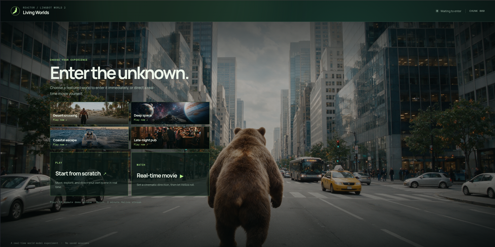
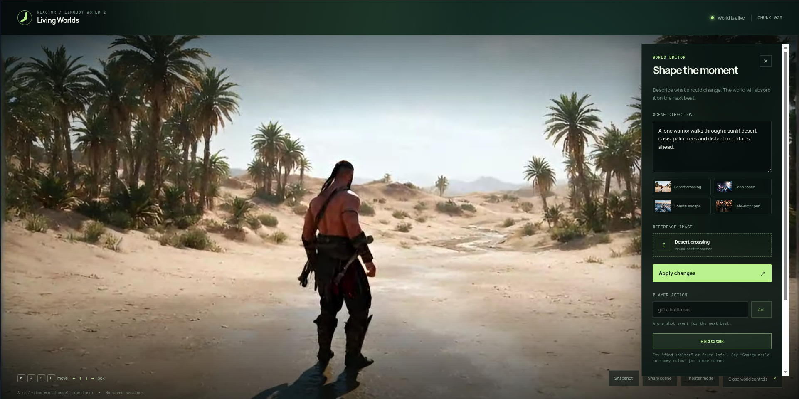
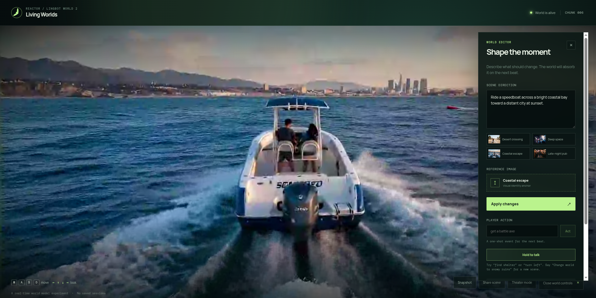
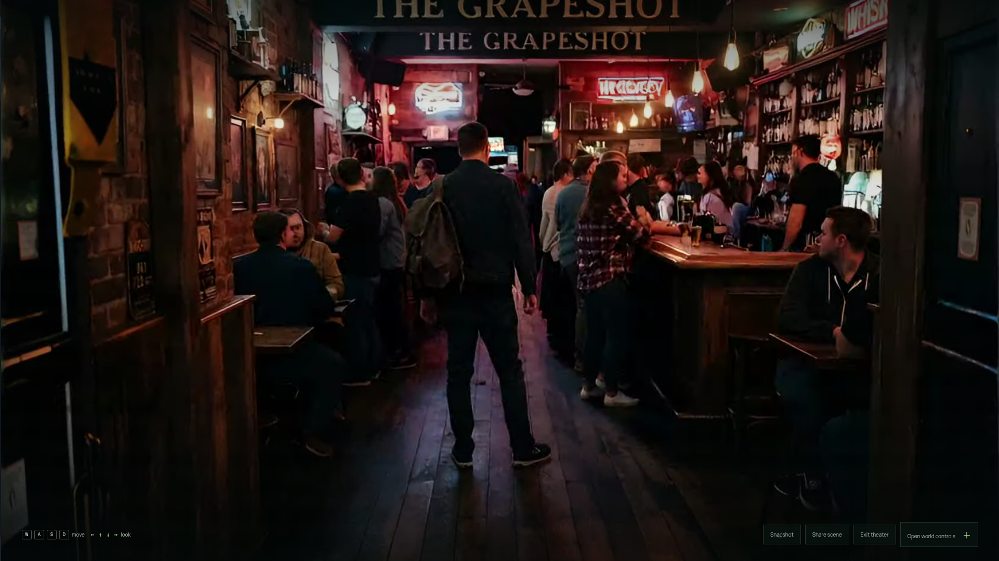
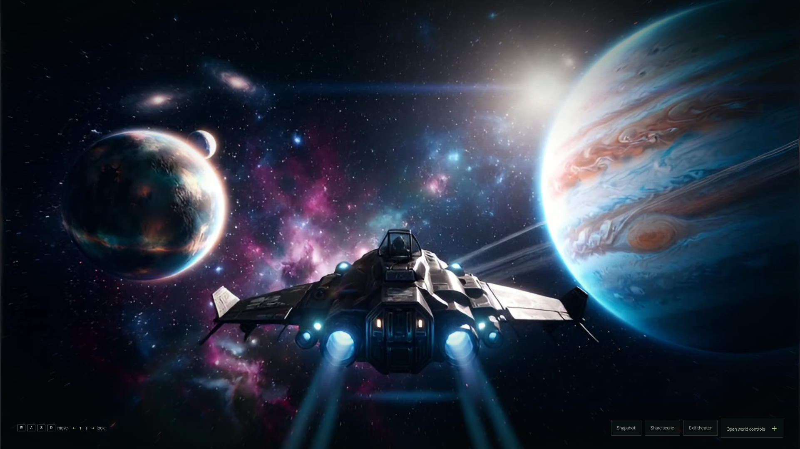

# Living Worlds

**A real-time AI demo where you can enter a generated world or direct a live movie.**

Living Worlds pairs Reactor world and movie models with a small browser experience built for demos, kiosks, and curious first-time visitors. Choose a featured world to start playing immediately, or shape a Helios movie with your own prompt and image.

## Screenshots

### Featured worlds landing

  

### Play mode

 
 

### Watch mode

  
  


## What you can do

- **Enter a featured world in one click.** Each curated world starts Play with its matching prompt and reference image.
- **Play a living world.** Move with the keyboard, reshape the scene, upload a reference image, or hold to talk in English.
- **Direct a real-time movie.** Set a prompt and optional visual anchor, then watch Helios generate live.
- **Keep or share the moment.** Download a JPEG snapshot, share the current mode and prompt, or switch to Theater mode for a clean fullscreen view.

## Run locally

### Prerequisites

- Python 3.11+
- Node.js 20+
- A Reactor API key with access to `lingbot-world-2` and `helios`
- A Deepgram API key for English speech-to-text

### Setup

```bash
cp backend/.env.example backend/.env
# Add REACTOR_API_KEY and DEEPGRAM_API_KEY to backend/.env

./start.sh
```

The launcher creates the backend virtual environment, installs missing dependencies, and starts:

- FastAPI at <http://127.0.0.1:8000>
- Vite at <http://127.0.0.1:5173>

The frontend proxies `/api` to FastAPI. API keys stay on the server; the browser receives only a short-lived Reactor token.

## Demo controls

### Play

- Use **WASD** to move and the **arrow keys** to look around.
- Edit the scene prompt and apply it, or select a visual preset.
- Hold **Hold to talk** for an action such as “find shelter.” Say `Change world to snowy ruins` to replace the scene instead.
- Capture a frame, share the prompt, or enter Theater mode from the bottom controls.

See [voice controls](docs/voice-controls.md) for voice behavior and troubleshooting.

### Watch

- Choose a movie direction and, optionally, a reference image for the opening shot.
- Watch includes a two-minute default session cap and an estimate based on Helios at `$6/hour`.
- Pause, restart, capture, share, or enter Theater mode while the movie runs.

## Configuration

Copy `frontend/.env.example` to `frontend/.env` only when you need different local demo limits:

```bash
VITE_MAX_SESSION_SECONDS=600
VITE_MAX_WATCH_SECONDS=120
```

The backend also accepts `CORS_ORIGINS` in `backend/.env`; its default allows the local Vite addresses.

## Architecture and privacy

The React frontend connects directly to the selected Reactor model after FastAPI exchanges the private Reactor API key for a short-lived browser token. Voice recordings are sent to Deepgram only for transcription and are not stored by this app. There are no accounts, cloud session history, uploaded-image storage, or billing integration.

## Checks

Run these from `frontend/`:

```bash
npm run build
npm run test:voice
npm run test:share
```
